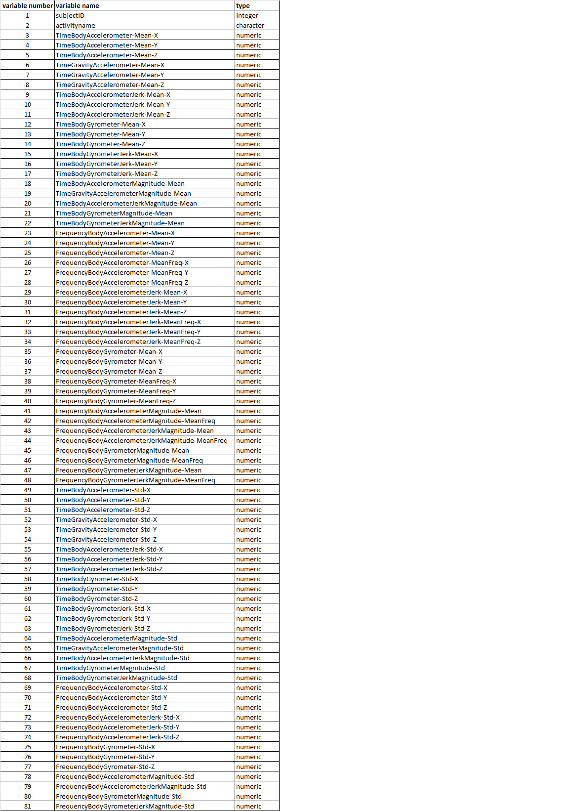
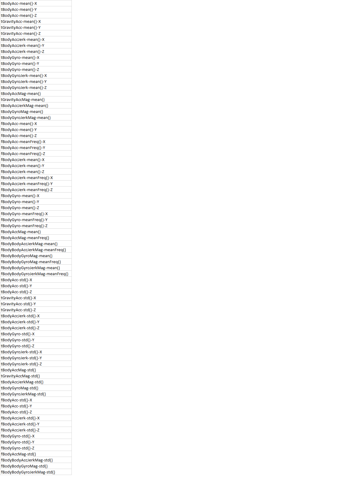

This **Code Book** describes the data, the variables and the work that was performed 
to clean up the data.

**1. The data**

The data used for this Assignment are from an experiment about _Human Activity Recognition Using Smartphones_
and are stored in a zip file that was downloaded from the website from the following link:
(https://d396qusza40orc.cloudfront.net/getdata%2Fprojectfiles%2FUCI%20HAR%20Dataset.zip)

The following files from the zip file were used for the analysis in this assignment:

    features.txt        (contains a list of features)
    activity_labels.txt (links the class labels with their activity name)
    subject_test.txt    (subject ID for test data)
    x_test.txt          (test data set)
    y_test.txt          (labels for the test data)
    subject_train.txt   (subject ID for training data)
    x_train.txt         (training data set)
    y_train.txt         (subject ID for training data)

The above files contain data on 30 subjects who participated in the experiment. 
The subject were divided into 2 groups to create Train data (using 70% of the subjects) 
and Test data (using the remaining 30% of the subjects).
Each subject performed a set of 6 activities which had a _label_ and an _activity name_ as follows:

    1. WALKING
    2. WALKING_UPSTAIRS
    3. WALKING_DOWNSTAIRS
    4. SITTING
    5. STANDING
    6. LAYING

The data for the 30 subjects and for each activity was collected using an accelerometer 
and a gryometer. These measurements were called _features_ in the experiment.

**2. The variables**

The tidy data set stored in **tidy_data.txt** contains 81 variables. The first two variables
contain the subject ID (a number from 1 to 30) and the name of the activity (from the list of the 6
activities described above) respectively. The remaining 79 variables contain an average of the measurement
for each subject and each activity. This was computed as part of the analysis using the function mean().

The unit for the accelerometer variables is 'g' (standard gravity units). 
The unit for the gyrometer variables is 'radians/second'.

The word accelerometer or gyrometer is included in the variable name for easy identification.

A summary of all the variables is provided in the following table:

Additional information on these variables from the original code books is included at the end
of this document for easy reference in the sections called **Appendix I** and **Appendix II**.

**3. Work performed to clean up the data**

(i) Read in the files described in section 1 above containing the feetures, 
activity labels, Test data and Train data in the data frames described in the following table:

    Name (dimension)          | Description of contents
    ---------------------     | -----------------------------
    feautures (561 x 2)       | accelerometer and gyroscope 3-axial raw signals 
    test_subject (2947 x 1)   | Subject ID for Test data (values between 1 to 30)
    test_set (2947 x 561)     | measurements for the features for Test data       
    test_label (2947 x 1)     | labels (values between 1 to 6) for each activity for Test data
    train_subject (7352 x 1)  | Subject ID for Train data (values between 1 to 30)
    train_set (7352 x 561)    | measurements for the feature for Train data   
    train_label (7352 x 1)    | labels (values between 1 to 6) for each activity for Train data
    activities (6 x2)         | activity label and activity name as described in the list above

(ii) Name the columns of test_set and train_set according to the corresponding features.

(iii) Create test_data and then train_data using cbind(). Each data set is a combination 
of the subject, activity label and measurements for Test and Train data respectively.
test_data and train_data were merged together using rbind() to create one data set called merge_data. 
The description of each data frame is provided below:

    Name (dimension)              | Description 
    -------------------------     | ------------
    test_data (2947 x 563)        | subject, activity label and measurements for Test data
    train_data (7352 x 563)       | subject, activity label and measurements for Train data
    merged_data (10299 x 563)     | all measurements for the Train and Test data for each subject 
                                  | and each activity.    

(iv) Extract only the measurements of the mean and standard deviation for each measurement.
These are stored in a data frame called mean_std_data (10299 x 81).

(v) Descriptive activity names were then assigned to the activities in mean_std_data and
stored in mean_std_activity.

(vi) The data set was labeled with descriptive variable names by performing
the following changes on the original variable names:

    Original                    | Replacement
    ----------                  | ------------
    t (at the begining of name) | Time
    f (at the begining of name) | Frequency
    mean                        | Mean
    std                         | Std
    BodyBody                    | Body
    Acc                         | Acceleration
    Gyro                        | Gyrometer
    Mag                         | Magnitude

In addition, parentheses and underscores were also removed. However, capital letters and 
hyphens were used to make the name easier to read as the variable description is complex and 
hence long variable names are needed. 

So for example, *tBodyAcc-mean()-X* becomes *TimeBodyAccelerometer-Mean-X*
The origina variable names are shown in Appendix II and can be compared with the 
new descriptive variables shown in table 2 above for a full comparison.

The data set is stored in a data frame called mean_std_activity (10299 x 81). 

(vi) Convert the mean_std_activity from data.frame to a data.table class for
easier manipulation. Reorder the columns so that the first 2 columns are subjectID 
and activity, which are then followed by other variables containing the measurements.
Reorder the rows by subjectID in ascending order (from 1 to 30). This creates a tidy data set 
which is stored in tidy_data (10299 x 81).

(vii) Create a second independent tidy data set with the average of each variable
for each activity and each subject. This is stored in tidy_data_average (180 x 81)
and also written out to a text file called **tidy_data.txt**.

## Appendix I

**This is the information provided in the original code book "features_info.txt".**

The features selected for this database come from the accelerometer and gyroscope 3-axial raw signals tAcc-XYZ and tGyro-XYZ. These time domain signals (prefix 't' to denote time) were captured at a constant rate of 50 Hz. Then they were filtered using a median filter and a 3rd order low pass Butterworth filter with a corner frequency of 20 Hz to remove noise. Similarly, the acceleration signal was then separated into body and gravity acceleration signals (tBodyAcc-XYZ and tGravityAcc-XYZ) using another low pass Butterworth filter with a corner frequency of 0.3 Hz. 

Subsequently, the body linear acceleration and angular velocity were derived in time to obtain Jerk signals (tBodyAccJerk-XYZ and tBodyGyroJerk-XYZ). Also the magnitude of these three-dimensional signals were calculated using the Euclidean norm (tBodyAccMag, tGravityAccMag, tBodyAccJerkMag, tBodyGyroMag, tBodyGyroJerkMag). 

Finally a Fast Fourier Transform (FFT) was applied to some of these signals producing fBodyAcc-XYZ, fBodyAccJerk-XYZ, fBodyGyro-XYZ, fBodyAccJerkMag, fBodyGyroMag, fBodyGyroJerkMag. (Note the 'f' to indicate frequency domain signals). 

These signals were used to estimate variables of the feature vector for each pattern:  
'-XYZ' is used to denote 3-axial signals in the X, Y and Z directions.

The complete list of variables of each feature vector is available in 'features.txt'. 

## Appendix II
**The assignment requested the use of a subset of the variables available in 'features.txt',**
**namely those variables that contain the mean and standard deviation for each measurement.** 
**They are show in the following table:**

