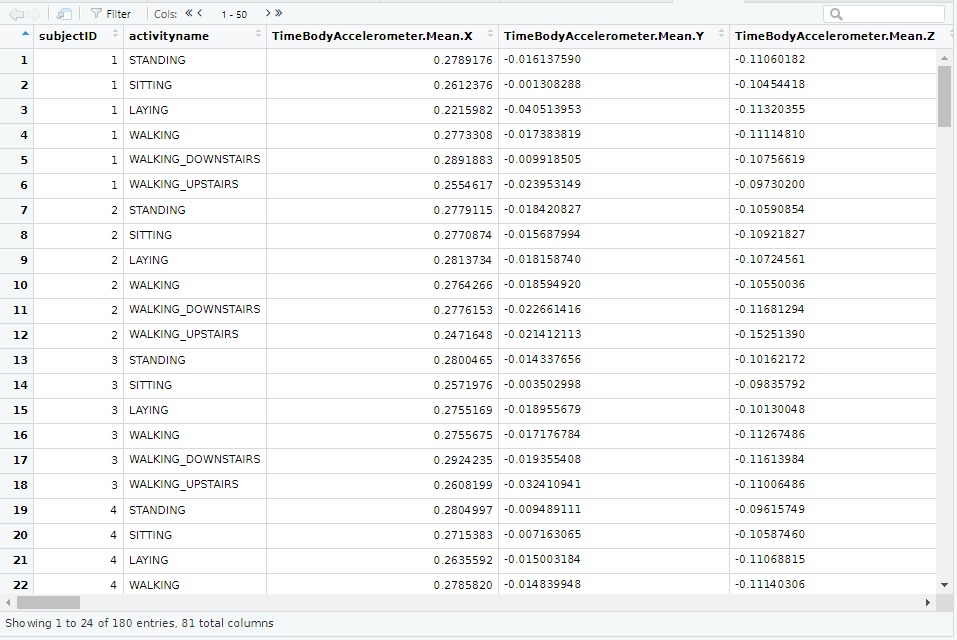

# README.md

This repository contains the files for the Peer Review assignment of Coursera's **Getting and Cleaning Data** course. 
The objective of the assignment is to demonstrate the ability to *collect*, *work with*, and *clean* a data set. 
The data used and analyzed are from an experiment about _Human Activity Recognition Using Smartphones_.

This **README** file provides an overview of the files, the script and how they are connected.

In addition to this **README** file, in this repository you will find:

(I) An R script called **run_analysis.R** which does the following:

      1. Merges the training and the test sets to create one data set.
      2. Extracts only the measurements on the mean and standard deviation for each measurement.
      3. Uses descriptive activity names to name the activities in the data set
      4. Appropriately labels the data set with descriptive variable names.
      5. Creates a second, independent tidy data set from the data set in step 4,
         with the average of each variable for each activity and each subject.
      
In addition, the script also includes code for downloading the zip file containing the data
required for the analysis, unzipping the contents and reading in the data required for the analysis.
The tidy data set created in step 5 is saved in a text file called tidy_data.txt

The R script is very well documented to make it easy to follow what each chunk of code does.

(II) The tidy data set created in step 5 above and stored as a text file called **tidy_data.txt**. 
This tidy data sets meets the criteria of a tidy data set, namely:

      1. Each variable forms a column.
      2. Each observation forms a row.
      3. Each type of observational unit forms a table.
    
Please refer to items 1 and 2 in the **References** section for more information and examples 
on what constitutes Tidy Data.

The following sample code can be used to read **tidy_data.txt** back into R and view it using
the R viewer (the file path may need to be changed according to where you save the file):

    file_path <- "./tidy_data.txt"
    data <- read.table(file_path, header=TRUE)
    View(data)
    
The image below shows the contents of tidy_data.txt obtained after reading the file
back into R with the sample code provided above. 

    
(III) A code book called **CodeBook.md** that modifies and updates the available codebooks for the original data to indicate all the variables and summaries calculated, along with units and other relevant information.

(IV) The subdirectory called _images_ contains the images that are embedded in this **README.md** file and in **CodeBook.md**.

**References:**

  1. Paper on Tidy Data by Hadley Wickham: (https://vita.had.co.nz/papers/tidy-data.pdf)  
  2. CRAN vignette on Tidy Data: (https://cran.r-project.org/web/packages/tidyr/vignettes/tidy-data.html)
  3. General reference: (https://thoughtfulbloke.wordpress.com/2015/09/09/getting-and-cleaning-the-assignment/)
      
